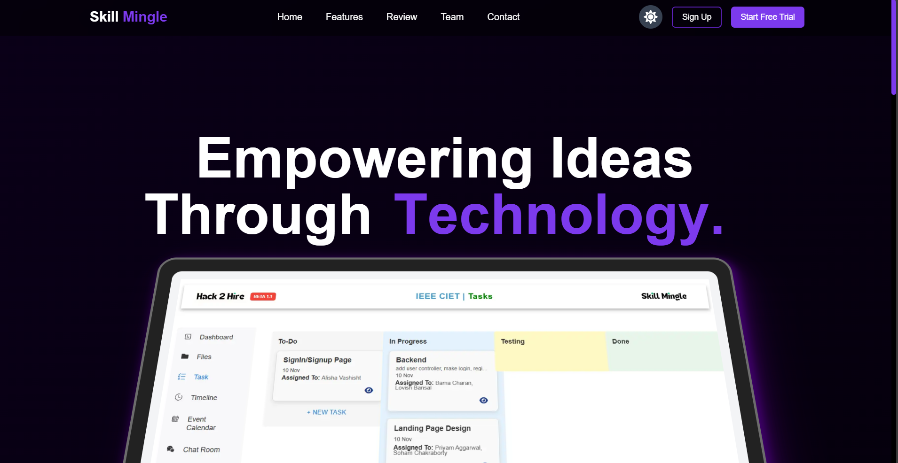
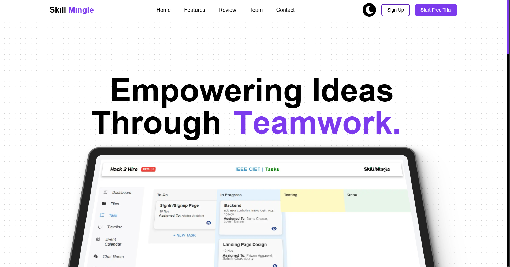

# 🛠️ **SKILL MINGLE** 🛠️

An innovative solution for seamless task and project management, leveraging AI for task allocation, real-time collaboration, and enhanced productivity.
[Click here:](https://skillmingle.vercel.app/)

---

## 🌐 **Introduction**

  
  

- **What is the Project Management Platform?**  
  A cutting-edge tool designed to simplify project management with advanced features like AI-driven task allocation, real-time collaboration, and gamification for improved team productivity.

- **Why Choose Us?**  
  Our platform combines intuitive UI, real-time capabilities, and intelligent features to meet the needs of modern teams.

---

## 🔍 **Core Features**

### 1️⃣ **Task & Project Management**
- AI-powered task allocation with drag-and-drop charts to visualize task dependencies and timelines.
- Easy-to-use interface for organizing and managing tasks at scale.

### 2️⃣ **Real-Time Collaboration**
- **Real-Time Chat**: Powered by Socket.io for instant communication.  
- **Google Meet Integration**: Seamlessly schedule and join video meetings within the platform.

### 3️⃣ **Version Control & Progress Tracking**
- Integration with GitHub/GitLab for tracking commits, milestones, and live updates on task progress.  
- Version control tools ensure every team member stays on the same page.

### 4️⃣ **Enhanced Team Productivity**
- **Gamification**: Earn badges to motivate and recognize team efforts.  
- **Push Notifications**: Real-time notifications for task updates and deadlines.

---

## 🚀 **Tech Stack**

### **Backend**
- **Express.js**: Efficient handling of real-time task updates and collaboration requests.  
- **MongoDB**: Scalable database for managing project tasks, events, and progress.  
- **JWT & Bcrypt**: Secure authentication for teams, protecting sensitive project data.  
- **AI**: Gemini API for AI-driven ticket recommendations.

### **Frontend**
- **Next.js**: SEO-friendly and fast user interface for real-time updates.  
- **Socket.io**: Powers real-time chat for instant team communication.

### **Deployment**
- **Docker**: Ensures smooth containerization and deployment.  
- **Vercel**: Optimized for Next.js applications, ensuring reliable performance.

---

## ✨ **Uniqueness**

- **IEEE-CIET Collaboration**: Designed with cutting-edge innovation and professional input.
- **AI Task Allocation**: Revolutionizes task assignment with intelligent recommendations.
- **Gamification**: Boosts productivity through badges and motivational tools.
- **Drag-and-Drop Roadmap**: Intuitive visual planning of tasks and timelines.
- **Real-Time Communication**: Instant chat and meeting integration for seamless collaboration.

---

## 🤝 **How to Contribute**

### 1️⃣ **Getting Started**
- **Fork**: Create your copy by forking the repository.  
- **Clone**: Clone it locally using `git clone <repo-link>`.  
- **Setup**: Install dependencies with `npm install`.

### 2️⃣ **Making Contributions**
- Understand the project structure and follow the coding standards.  
- Make your changes and test thoroughly to ensure they work as expected.

### 3️⃣ **Submit Your Changes**
- Create a new branch: `git checkout -b feature/your-feature-name`.  
- Commit your changes: `git commit -m "Add your feature description"`.  
- Push the branch: `git push origin feature/your-feature-name`.  
- Open a pull request for review.

---

## 🙌 Meet the Team

|  |  |  |  |  |
|:---:|:---:|:---:|:---:|:---:|
| [**Priyam Aggarwal**](https://www.linkedin.com/in/priyamaggarwal/)   *Team Lead* | [**Soham Chakraborty**](https://www.linkedin.com/in/soham-chakraborty-108450255/)   *Frontend Developer* | [**Alisha Vashisht**](https://www.linkedin.com/in/alisha-vashisht-56534620b/)   *Frontend Developer* | [**Lovish Bansal**](https://www.linkedin.com/in/lovish2584-profile/)   *Backend Developer* | [**Bama Charan**](https://www.linkedin.com/in/bamacharanchhandogi/)   *Backend Developer* |

---

## 📜 **License**
This project is licensed under the [MIT License](LICENSE). Feel free to use, modify, and distribute it as needed.

